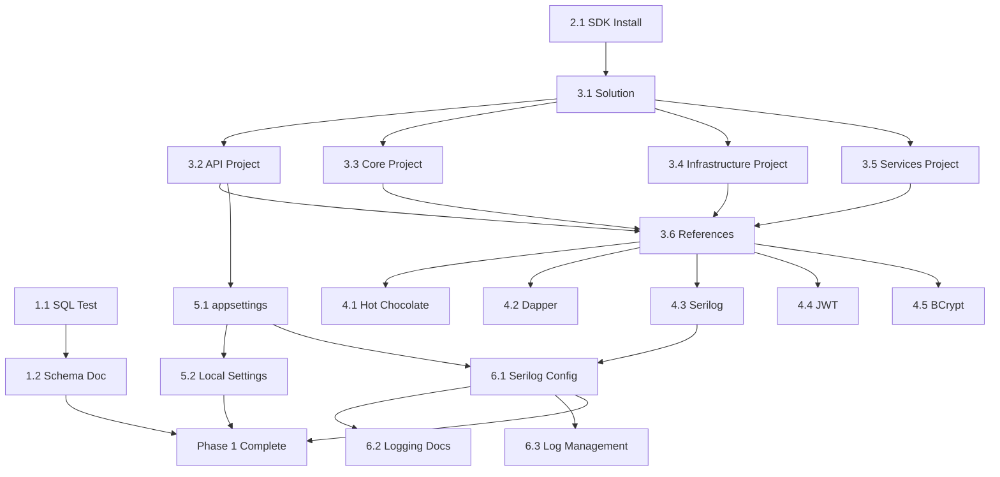

# Phase 1 - Priority Matrix and Execution Plan

**Version:** 1.0
**Date:** 2025-11-05
**Purpose:** Task prioritization and parallel execution strategy

---

## Priority Matrix

### Priority Legend
- **P0 (Critical):** Blocks all other work, must complete first
- **P1 (High):** Blocks multiple downstream tasks
- **P2 (Medium):** Important but can be done in parallel
- **P3 (Low):** Nice to have, can be deferred

### Task Priority Matrix

| Task ID | Task Name | Priority | Value | Effort | Dependencies | Blocks | Agent | Target |
|---------|-----------|----------|-------|--------|--------------|--------|-------|--------|
| **1.1** | SQL Server Connection Test | **P0** | High | Low | None | 1.2, Phase 2 | DevOps | Day 1 AM |
| **1.2** | Database Schema Documentation | **P1** | High | Medium | 1.1 | Phase 2 entities | DevOps | Day 1 PM |
| **2.1** | .NET 8 SDK Installation | **P0** | High | Low | None | All .NET tasks | Backend | Day 1 AM |
| **2.2** | VS Code Extensions | **P2** | Medium | Low | 2.1 | None (DX) | Backend | Day 1 PM |
| **2.3** | Workspace Configuration | **P3** | Low | Low | 2.2 | None | Backend | Day 2 |
| **3.1** | .NET Solution Creation | **P1** | High | Low | 2.1 | 3.2-3.6 | Architect | Day 1 PM |
| **3.2** | API Project Creation | **P1** | High | Low | 3.1 | 3.6, 4.x, 5.x | Architect | Day 1 PM |
| **3.3** | Core Project Creation | **P1** | High | Low | 3.1 | 3.6, Phase 2 | Architect | Day 1 PM |
| **3.4** | Infrastructure Project | **P1** | High | Low | 3.1 | 3.6, 4.2 | Architect | Day 1 PM |
| **3.5** | Services Project Creation | **P2** | Medium | Low | 3.1 | 3.6, 4.5 | Architect | Day 1 PM |
| **3.6** | Project References | **P1** | High | Low | 3.2-3.5 | Phase 2-5 | Architect | Day 2 AM |
| **4.1** | Hot Chocolate Packages | **P1** | High | Low | 3.2, 3.6 | Phase 5 | Backend | Day 2 AM |
| **4.2** | Dapper Packages | **P1** | High | Low | 3.4, 3.6 | Phase 2 | Backend | Day 2 AM |
| **4.3** | Serilog Packages | **P1** | High | Low | 3.2, 3.6 | 6.1 | Backend | Day 2 AM |
| **4.4** | JWT Packages | **P2** | Medium | Low | 3.2, 3.6 | Phase 4 | Backend | Day 2 AM |
| **4.5** | BCrypt Package | **P2** | Medium | Low | 3.5, 3.6 | Phase 4 | Backend | Day 2 AM |
| **5.1** | Base appsettings.json | **P1** | High | Low | 3.2 | 5.2, 6.1 | Backend | Day 2 PM |
| **5.2** | Local Settings File | **P1** | High | Medium | 5.1 | Run app | Backend | Day 2 PM |
| **5.3** | .gitignore Update | **P0** | High | Low | None | Security | DevOps | Day 1 AM |
| **5.4** | Environment Variables Doc | **P3** | Low | Low | 5.1 | Phase 9 | DevOps | Day 3 |
| **6.1** | Serilog Configuration | **P1** | High | Medium | 4.3, 5.1 | Testing | Backend | Day 2 PM |
| **6.2** | Structured Logging Docs | **P3** | Low | Low | 6.1 | None (docs) | Backend | Day 3 |
| **6.3** | Log File Management | **P2** | Medium | Low | 6.1 | Ops | Backend | Day 3 |

---

## Value vs. Effort Analysis

### High Value + Low Effort (Do First)
1. ✅ **1.1 - SQL Server Connection Test:** Validates critical assumption early
2. ✅ **2.1 - .NET 8 SDK Installation:** Enables all .NET work
3. ✅ **5.3 - .gitignore Update:** Prevents security incidents
4. ✅ **3.1 - Solution Creation:** Quick win, unblocks project creation

**Action:** Prioritize these on Day 1 morning

### High Value + High Effort (Plan Carefully)
1. **1.2 - Database Schema Documentation:** Takes time but critical for Phase 2
2. **3.6 - Project References:** Must be done correctly (dependency graph)
3. **5.2 - Local Settings File:** Requires actual credentials, careful documentation
4. **6.1 - Serilog Configuration:** Must work correctly for debugging

**Action:** Allocate senior developer time, test thoroughly

### Low Value + Low Effort (Quick Wins)
1. **2.2 - VS Code Extensions:** Nice DX improvement
2. **4.4 - JWT Packages:** Prepare for Phase 4
3. **4.5 - BCrypt Package:** Prepare for Phase 4

**Action:** Batch install, delegate to junior devs

### Low Value + High Effort (Defer or Skip)
*None identified in Phase 1* - all tasks have clear justification

---

## Parallel Execution Strategy

### Wave 1: Day 1 Morning (Foundations)
**Parallel Track A (DevOps Engineer):**
- Task 1.1: SQL Server Connection Test (30 min)
- Task 5.3: .gitignore Update (15 min)
- Start Task 1.2: Database Schema Documentation (ongoing)

**Parallel Track B (Backend Developer):**
- Task 2.1: .NET 8 SDK Installation (30 min)
- Task 2.2: VS Code Extensions (20 min)
- Verify setup with test project (20 min)

**Wave 1 Complete:** SQL accessible, .NET ready, repo secure

---

### Wave 2: Day 1 Afternoon (Project Structure)
**Parallel Track A (Technical Architect):**
- Task 3.1: Create Solution (10 min)
- Task 3.2: Create API Project (15 min)
- Task 3.3: Create Core Project (15 min)
- Task 3.4: Create Infrastructure Project (15 min)
- Task 3.5: Create Services Project (15 min)

**Parallel Track B (DevOps Engineer):**
- Continue Task 1.2: Database Schema Documentation (2 hours)
- Document ER diagram
- Extract all indexes

**Wave 2 Complete:** All projects created, schema documented

---

### Wave 3: Day 2 Morning (Dependencies)
**Parallel Track A (Technical Architect):**
- Task 3.6: Configure Project References (30 min)
- Verify dependency graph
- Test full solution build

**Parallel Track B (Backend Developer):**
- Task 4.1: Install Hot Chocolate (10 min)
- Task 4.2: Install Dapper (10 min)
- Task 4.3: Install Serilog (10 min)
- Task 4.4: Install JWT (10 min)
- Task 4.5: Install BCrypt (10 min)
- Run `dotnet restore` and verify (10 min)

**Wave 3 Complete:** All references configured, all packages installed

---

### Wave 4: Day 2 Afternoon (Configuration & Logging)
**Parallel Track A (Backend Developer):**
- Task 5.1: Create appsettings.json (30 min)
- Task 5.2: Create appsettings.Local.json template (20 min)
- Task 5.2: Test with actual credentials locally (20 min)

**Parallel Track B (Backend Developer):**
- Task 6.1: Configure Serilog in Program.cs (45 min)
- Test console logging
- Test file logging
- Verify log rotation

**Wave 4 Complete:** App can run, configuration working, logging operational

---

### Wave 5: Day 3 (Polish & Documentation)
**All Team Members:**
- Task 2.3: Workspace Configuration (30 min)
- Task 5.4: Environment Variables Documentation (45 min)
- Task 6.2: Structured Logging Examples (1 hour)
- Task 6.3: Log File Management Verification (30 min)
- Create Phase 1 Summary Document (1 hour)
- Quality Assurance Checklist Review (1 hour)

**Wave 5 Complete:** Phase 1 fully documented and ready for handoff

---

## Critical Path Analysis

### Critical Path (Longest Dependency Chain):
```
2.1 (SDK Install)
  → 3.1 (Solution)
    → 3.2 (API Project)
      → 3.6 (References)
        → 4.3 (Serilog Packages)
          → 5.1 (appsettings.json)
            → 6.1 (Serilog Config)
              → Phase 1 Complete
```

**Critical Path Duration:** ~6-7 hours of sequential work

**Parallelizable Work:** ~10-12 hours
**Total Effort:** ~17-19 hours
**With Parallelization:** ~2-3 days (3-4 people)

---

## Risk Mitigation in Prioritization

### Risk 1: SQL Server Connectivity Failure
**Mitigation:** Task 1.1 is P0 (first thing to test)
**Contingency:** If fails, escalate immediately, document network requirements
**Impact if not mitigated:** Entire Phase 2 blocked

### Risk 2: Package Version Conflicts
**Mitigation:** Use specific version numbers (not "latest")
**Contingency:** Document exact versions in matrix
**Impact if not mitigated:** Build failures, wasted debug time

### Risk 3: Secrets Committed to Git
**Mitigation:** Task 5.3 (.gitignore) is P0, done before creating secrets
**Contingency:** Git hook to scan for secrets (future)
**Impact if not mitigated:** Security breach, credential rotation

### Risk 4: Configuration Doesn't Work in Prod
**Mitigation:** Task 5.4 documents environment variable approach early
**Contingency:** Test with env vars in dev
**Impact if not mitigated:** Deployment failures in Phase 9

---

## Resource Allocation

### Required Roles

| Role | Tasks | Estimated Hours | Availability Needed |
|------|-------|-----------------|---------------------|
| **DevOps Engineer** | 1.1, 1.2, 5.3, 5.4 | 6-7 hours | Day 1-2 |
| **Backend Developer** | 2.1, 2.2, 2.3, 4.x, 5.1, 5.2, 6.x | 10-12 hours | Day 1-3 |
| **Technical Architect** | 3.1-3.6 | 4-5 hours | Day 1-2 |
| **All Roles** | Documentation, QA | 3-4 hours | Day 3 |

**Total Team Effort:** ~23-28 person-hours
**With 3 people:** 8-10 hours each over 3 days
**With 2 people:** 12-14 hours each over 4 days

### Optimal Team Configuration
- **1 Technical Architect** (lead, part-time)
- **1 Backend Developer** (full-time)
- **1 DevOps Engineer** (part-time, Day 1-2)

**Single Developer?** Estimate 3-4 full days working sequentially

---

## Dependency Graph



---

## Task Execution Checklist

### Pre-Phase 1 Checklist
- [ ] Phase 0 documentation reviewed and approved
- [ ] Database credentials obtained (SQL Server user/password)
- [ ] Developer workstations prepared (Windows 10+)
- [ ] Git repository access verified for all team members
- [ ] Network access to SQL Server confirmed (firewall rules)

### Day 1 Morning Checklist
- [ ] Task 1.1: SQL connection tested successfully
- [ ] Task 2.1: .NET 8 SDK installed and verified
- [ ] Task 5.3: .gitignore updated and committed
- [ ] Task 2.2: VS Code extensions installed

### Day 1 Afternoon Checklist
- [ ] Task 3.1: Solution created
- [ ] Task 3.2: API project created
- [ ] Task 3.3: Core project created
- [ ] Task 3.4: Infrastructure project created
- [ ] Task 3.5: Services project created
- [ ] Task 1.2: Database schema documented

### Day 2 Morning Checklist
- [ ] Task 3.6: Project references configured
- [ ] Full solution builds without errors
- [ ] Task 4.1: Hot Chocolate installed
- [ ] Task 4.2: Dapper installed
- [ ] Task 4.3: Serilog installed
- [ ] Task 4.4: JWT installed
- [ ] Task 4.5: BCrypt installed
- [ ] All packages restored successfully

### Day 2 Afternoon Checklist
- [ ] Task 5.1: appsettings.json created (no secrets)
- [ ] Task 5.2: appsettings.Local.json template created
- [ ] Developer has working Local.json with credentials
- [ ] Task 6.1: Serilog configured in Program.cs
- [ ] Console logging verified
- [ ] File logging verified
- [ ] Application runs successfully

### Day 3 Checklist
- [ ] Task 2.3: Workspace configuration completed
- [ ] Task 5.4: Environment variables documented
- [ ] Task 6.2: Structured logging examples created
- [ ] Task 6.3: Log management verified
- [ ] All documentation completed
- [ ] Phase 1 summary created
- [ ] Quality assurance checklist completed
- [ ] Phase 1 sign-off obtained

---

## Blocking Issues Resolution

### If Task 1.1 Fails (SQL Connection)
**Symptoms:** Cannot connect to 10.10.10.69
**Diagnosis Steps:**
1. Ping server: `ping 10.10.10.69`
2. Check firewall: `Test-NetConnection -ComputerName 10.10.10.69 -Port 1433`
3. Verify SQL credentials
4. Check SQL Server authentication mode (mixed mode)

**Resolution Options:**
- Contact IT/Network team for firewall rule
- Use VPN if required
- Verify SQL Server is running
- Test with SSMS or sqlcmd

**Escalation Path:** DevOps → IT Infrastructure → DBA

---

### If Task 2.1 Fails (SDK Install)
**Symptoms:** `dotnet --version` not working
**Diagnosis Steps:**
1. Check if SDK downloaded (not just runtime)
2. Verify PATH environment variable
3. Restart terminal/computer

**Resolution Options:**
- Download correct SDK from official site
- Manual PATH configuration
- Use Visual Studio installer as alternative

**Escalation Path:** Developer → Senior Developer → Architect

---

### If Task 3.6 Fails (Build Errors)
**Symptoms:** `dotnet build` fails
**Diagnosis Steps:**
1. Check for circular dependencies
2. Verify project reference paths
3. Check target framework consistency (all net8.0)

**Resolution Options:**
- Remove and re-add references
- Clean solution: `dotnet clean`
- Delete bin/obj folders manually
- Verify .csproj XML syntax

**Escalation Path:** Architect → Senior Developer

---

### If Task 6.1 Fails (Logging Not Working)
**Symptoms:** No logs in console or file
**Diagnosis Steps:**
1. Verify Serilog packages installed
2. Check appsettings.json Serilog section
3. Check Program.cs UseSerilog() call
4. Verify logs/ folder permissions

**Resolution Options:**
- Review Serilog configuration syntax
- Test with minimal config first
- Check for exceptions during startup
- Verify log file path is writable

**Escalation Path:** Developer → Backend Lead

---

## Success Metrics Dashboard

### Completion Metrics (Track Daily)

| Metric | Day 1 Target | Day 2 Target | Day 3 Target | Final |
|--------|--------------|--------------|--------------|-------|
| Tasks Completed | 7/22 (32%) | 17/22 (77%) | 22/22 (100%) | 100% |
| Documentation Created | 2 docs | 5 docs | 7 docs | 7 docs |
| Stories Done | 4/18 | 14/18 | 18/18 | 18/18 |
| Build Success | N/A | 100% | 100% | 100% |
| Tests Passing | N/A | N/A | N/A | 0 (Phase 7) |

### Quality Metrics

| Metric | Target | How to Measure |
|--------|--------|----------------|
| Setup Time (New Dev) | < 2 hours | Time trial with fresh machine |
| Build Time | < 30 seconds | `dotnet build` execution time |
| Zero Secrets in Git | 100% | Manual review + git log search |
| Documentation Complete | 100% | Checklist review |
| All Packages Latest Stable | 100% | Version check against NuGet |

---

## Communication Plan

### Daily Standup (15 min)
- **Time:** 9:00 AM
- **Format:** What did I complete yesterday? What am I working on today? Any blockers?
- **Attendees:** All Phase 1 team members

### Progress Updates (EOD)
- **Time:** 5:00 PM
- **Format:** Update task board, commit code, document issues
- **Deliverable:** Daily progress summary in Slack/Teams

### Phase 1 Review (End of Day 3)
- **Time:** 4:00 PM Day 3
- **Format:** Demo working environment, review documentation
- **Attendees:** All team + Product Owner + Tech Lead
- **Outcome:** Phase 1 sign-off or list of remaining items

---

## Handoff to Phase 2

### Phase 1 Deliverables for Phase 2
1. **Working Development Environment:**
   - .NET 8 SDK installed
   - VS Code configured
   - All extensions working

2. **Project Structure:**
   - GraphQLApp.sln with 4 projects
   - All references configured
   - Solution builds successfully

3. **Database Access:**
   - SQL Server connection verified
   - dev_graphql database accessible
   - Complete schema documentation

4. **Configuration System:**
   - appsettings.json (template)
   - appsettings.Local.json (secure)
   - Environment variable docs

5. **Logging Infrastructure:**
   - Serilog configured
   - Console + file logging working
   - Log rotation configured

6. **Documentation:**
   - All Phase 1 docs in docs/phase_1/
   - Setup guide for new developers
   - Troubleshooting guide

### Phase 2 Readiness Checklist
- [ ] Can I create a new C# entity class in Core project?
- [ ] Can I create a repository in Infrastructure project?
- [ ] Can I add a Dapper query and see logs?
- [ ] Do I have the exact database schema documented?
- [ ] Can I run the application and see startup logs?

**If all yes:** Phase 2 can begin
**If any no:** Resolve before starting Phase 2

---

**Document End**

**Priority Matrix Version:** 1.0
**Last Updated:** 2025-11-05
**Next Review:** Daily during Phase 1 execution
